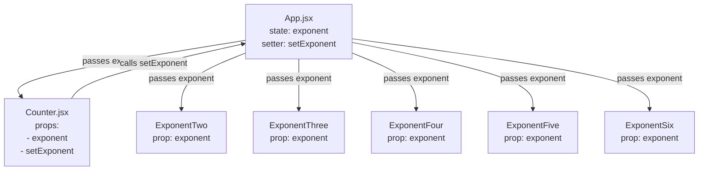

# Project Notes — Lifting State in React

## Setup

```bash
npm install
npm run dev
```

---

## Where the state is lifted (App.jsx)

**Lifting happens here** — the state is created in the common parent:

```js
const [exponent, setExponent] = useState(2);
```

This is the **single source of truth** for the app.

---

## Passing state and setters (App.jsx)

### To `Counter` (read + write)

```jsx
<Counter exponent={exponent} setExponent={setExponent} />
```

- `exponent` → current value (read)
- `setExponent` → function to update state (write)

### To Exponent components (read-only)

```jsx
<ExponentTwo exponent={exponent} />
<ExponentThree exponent={exponent} />
<ExponentFour exponent={exponent} />
<ExponentFive exponent={exponent} />
<ExponentSix exponent={exponent} />
```

In plain terms:  
`App.jsx` passes the **same value** to multiple child components.

```
ExponentTwo    ← exponent
ExponentThree ← exponent
ExponentFour  ← exponent
ExponentFive  ← exponent
ExponentSix   ← exponent
```

Each component:
- Receives the same input
- Applies a different transformation
- Produces a different result

> Same input → different outputs (functional thinking)

---

## Where state is consumed and updated (Counter.jsx)

`Counter` **does not own state**.  
It receives state and the setter as props:

```js
const Counter = ({ exponent, setExponent }) => {
  const decrement = () => setExponent(prev => prev - 1);
  const increment = () => setExponent(prev => prev + 1);
};
```

- `Counter` requests changes
- `App` performs the update

---

## What “lifting state” means

**Definition (one sentence):**

> Lifting state means moving shared state to the closest common parent so multiple components stay in sync.

### Why it’s needed
- Two or more components need the same data
- A change in one must affect the others

### What changes
❌ Each component has its own `useState`  
✅ Parent owns state, children receive props

---

## Data flow rules (React)

- State lives **up**
- Data flows **down** as props
- Changes flow **up** via setter functions

---

## Mermaid diagram — lifted state flow



---

## Summary

- State is **lifted** by moving `useState` to `App.jsx`
- `App` passes:
  - `exponent` → all components that read it
  - `setExponent` → only the component that updates it (`Counter`)
- All components stay in sync automatically

This is the canonical React pattern for shared state.